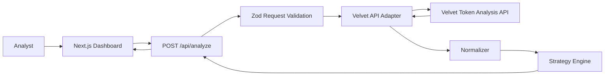

# Architecture

Velvet Lens is a read-only strategy lab for token research. The product takes user intent, enriches it through Velvet Capital's token analysis API, normalizes the result, and produces a deterministic strategy preview. The system is intentionally designed as an analysis cockpit rather than an execution product.

## Design Goals

- Keep Velvet credentials server-side.
- Present a premium analyst dashboard rather than a landing page.
- Normalize unstable external API response shapes into a stable UI contract.
- Generate strategy previews with deterministic, inspectable logic.
- Penalize incomplete data instead of pretending confidence is higher than it is.
- Keep the MVP read-only with no transaction, wallet, or custody surface.

## Non-Goals

- No wallet connection.
- No swap execution.
- No transaction signing.
- No automated portfolio rebalancing.
- No custody or asset management.
- No LLM-based strategy generation in the current implementation.

## System Context



## Request Lifecycle

1. The user enters a token, address, or thesis in `src/app/page.tsx`.
2. The browser sends the payload to `POST /api/analyze`.
3. `src/app/api/analyze/route.ts` validates the payload with Zod:
   - `input`
   - `chain`
   - `riskProfile`
   - `timeHorizon`
   - `capitalSize`
4. `src/lib/velvet.ts` calls Velvet's token analysis API with server-side credentials.
5. `src/lib/normalize.ts` walks the raw response and extracts a stable `NormalizedTokenAnalysis`.
6. `src/lib/strategy.ts` turns the normalized analysis and user preferences into a `StrategyPreview`.
7. The route returns `{ analysis, strategy }`.
8. The dashboard renders the strategy card, risk notes, allocation range, and raw JSON details.

## Module Boundaries

### `src/app/page.tsx`

Owns the client-side dashboard experience:

- Form state
- Loading, empty, error, no-data, and result states
- Risk profile and time horizon controls
- Strategy card rendering
- Premium terminal styling through Tailwind classes

This file does not know how to call Velvet directly. It only talks to `/api/analyze`.

### `src/app/api/analyze/route.ts`

Owns the server-side orchestration:

- Validates user input with Zod
- Calls the Velvet adapter
- Normalizes the raw response
- Builds the strategy preview
- Maps known error types to HTTP responses

This route is the boundary between browser-safe code and server-only code.

### `src/lib/velvet.ts`

Owns communication with Velvet:

- Reads `VELVET_API_KEY`
- Reads optional `VELVET_TOKEN_ANALYSIS_URL`
- Applies a request timeout
- Sends both `Authorization: Bearer` and `x-api-key` headers for gateway tolerance
- Converts upstream/network/timeout failures into `VelvetApiError`

No client component imports this module.

### `src/lib/normalize.ts`

Owns response shape tolerance:

- Recursively collects likely data objects from common wrapper keys
- Reads aliased fields such as `symbol`, `tokenSymbol`, `marketCap`, `market_cap`, and `fdv`
- Extracts fallback metrics from prose when structured fields are missing
- Parses markdown-like answer sections for technical, market, project, and risk summaries
- Keeps the raw response attached for inspection

This module protects the UI and strategy engine from external response drift.

### `src/lib/strategy.ts`

Owns deterministic strategy generation:

- Infers confidence when Velvet does not provide one
- Applies missing-data penalties
- Maps risk profile and confidence into an allocation range
- Creates entry logic, invalidation conditions, and watch-next lists
- Builds risk notes for smart contract, liquidity, volatility, narrative, and execution risk

The strategy engine is deliberately rule-based. The same normalized input and request settings produce the same output.

### `src/types/*`

Owns shared contracts:

- `AnalyzeRequest`
- `NormalizedTokenAnalysis`
- `StrategyPreview`
- `StrategyRiskNote`

These types are the internal API between route, normalizer, strategy engine, and UI.

## Data Contracts

### Analyze Request

```ts
interface AnalyzeRequest {
  input: string;
  chain?: string;
  riskProfile: "conservative" | "balanced" | "aggressive";
  timeHorizon: "intraday" | "swing" | "long-term";
  capitalSize?: number;
}
```

### Route Response

```ts
interface AnalyzeResponse {
  analysis: NormalizedTokenAnalysis;
  strategy: StrategyPreview;
}
```

### Normalized Analysis

The normalized analysis is intentionally broad and nullable. Missing values are expected and handled downstream.

```ts
interface NormalizedTokenAnalysis {
  token?: string;
  symbol?: string;
  name?: string;
  chain?: string;
  price?: number | string;
  marketCap?: number | string;
  liquidity?: number | string;
  volume?: number | string;
  technicalSummary?: string;
  fundamentalSummary?: string;
  onchainSummary?: string;
  sentimentSummary?: string;
  risks?: string[];
  confidence?: number;
  raw: unknown;
}
```

## Strategy Scoring

The strategy engine uses three main inputs:

- User risk profile
- User time horizon
- Normalized analysis completeness and confidence

If Velvet provides a confidence score, the app normalizes it into the `0..1` range. If not, confidence is inferred from how many important fields are present. Missing liquidity, volume, or risk data applies a penalty before allocation ranges are selected.

Allocation examples:

| Risk Profile | Strong Adjusted Confidence | Medium Adjusted Confidence | Low Adjusted Confidence |
| --- | --- | --- | --- |
| Conservative | `2-4%` | `1-3%` | `0-1%` |
| Balanced | `4-7%` | `3-5%` | `1-2%` |
| Aggressive | `7-12%` | `5-8%` or `2-4%` | `1-2%` |

This keeps the output explainable and reduces size when data quality is weak.

## Error Handling

Known failure paths:

- Invalid request payload: `400`
- Missing API key: `500`
- Velvet timeout: `504`
- Velvet non-OK response: upstream status, or `502` fallback
- Unknown server error: `500`

The UI has dedicated states for loading, unavailable analysis, no usable fields, empty state, and successful strategy output.

## Security Model

Velvet Lens follows a server-mediated API model:

- `VELVET_API_KEY` is read only in `src/lib/velvet.ts`.
- The browser never receives the key.
- The frontend only calls the local Next.js route.
- `.env.local` is ignored by Git.
- The MVP has no wallet, signing, or transaction code.

The most important security invariant is simple: any code that touches credentials must remain server-only.

## UI Architecture

The UI is built as a single dashboard surface rather than a marketing page.

Key states:

- Empty strategy console
- Loading analysis
- API/error state
- No-data state with raw JSON inspection
- Strategy result state

The strategy result uses a restrained reveal animation:

- Shell fade/blur/slide
- Subtle violet scan pass
- Staggered section entrance
- `prefers-reduced-motion` fallback

Global visual primitives live in `src/app/globals.css`, including:

- Dark near-black and purple background
- Terminal grid texture
- Premium glass panel treatment
- Strategy reveal animation

## Deployment Notes

Required runtime environment:

- Node.js compatible with Next.js 15
- `VELVET_API_KEY`
- Optional `VELVET_TOKEN_ANALYSIS_URL`

Recommended pre-deploy checks:

```bash
npm run lint
npm run typecheck
npm run build
```

## Extension Points

### Add a New Velvet Endpoint

Add or extend the adapter in `src/lib/velvet.ts`, then normalize the new response shape in `src/lib/normalize.ts`. Keep external response details out of the UI.

### Add Strategy History

Introduce persistence behind the API route. Store normalized inputs, strategy outputs, and timestamps. Avoid storing secrets or raw credentials.

### Add Vault Preview

Add a new server route and deterministic preview engine. Keep it read-only unless the product intentionally expands into execution flows.

### Add Tests

High-value test areas:

- Normalizer aliases and prose extraction
- Strategy allocation ranges and missing-data penalties
- API route validation and error mapping
- UI states for loading, error, no-data, and strategy result

## Operational Risks

- Velvet API response shape can change.
- External API latency can affect perceived responsiveness.
- Strategy output quality depends on normalized data quality.
- Rule-based strategy logic should be reviewed before expanding into any execution-related feature.

## Current Status

Velvet Lens is a read-only MVP. The architecture intentionally isolates external API access, normalization, strategy generation, and UI rendering so each layer can evolve without leaking responsibilities into the others.
